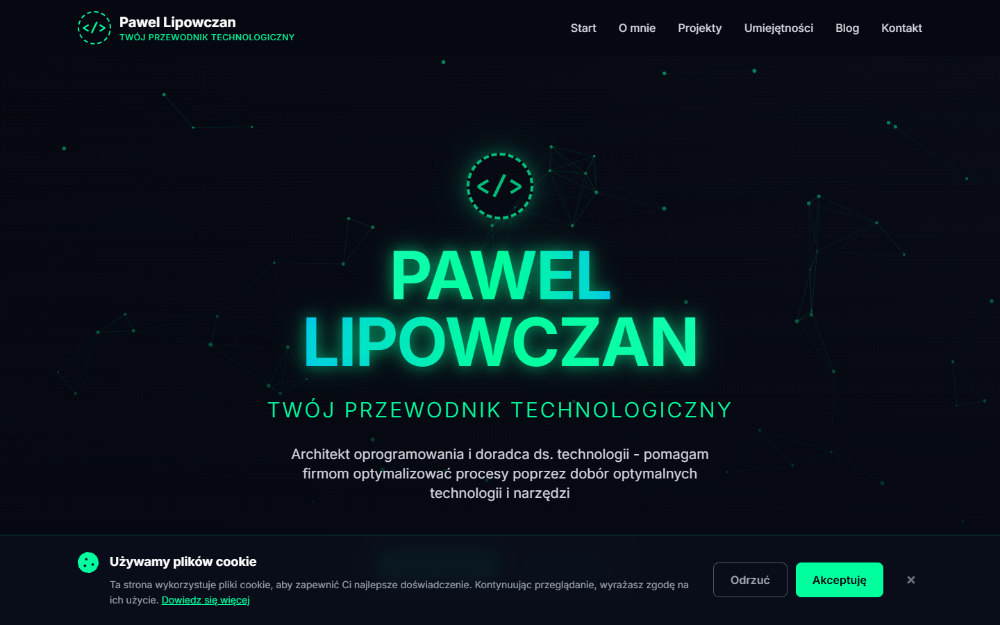

# Pawel Lipowczan - Portfolio Website

Modern, responsive portfolio website built with React, Vite, Tailwind CSS, and Framer Motion. Features a distinctive green/teal color scheme with animated UI elements and blog functionality.



## 🚀 Features

- **Modern Design** - Clean, professional design with gradient text effects and glassmorphism
- **Responsive** - Fully responsive design that works on all devices
- **Animated** - Smooth animations powered by Framer Motion
- **Blog System** - Built-in blog with markdown support
- **SEO Optimized** - Meta tags, semantic HTML, and structured data
- **Performance** - Fast loading times with optimized assets
- **Accessibility** - WCAG 2.1 Level AA compliant
- **Legal Pages** - GDPR/RODO compliant privacy policy, terms of service, and cookie policy

## 🎨 Design System

### Color Palette
- **Primary Green**: `#00ff9d`
- **Secondary Cyan**: `#00b8ff`
- **Dark Background**: `#050810` to `#0a0e1a`
- **Card Background**: `#151b2b`

### Typography
- **Headings**: Inter (Bold)
- **Body**: Inter (Regular)
- **Code**: Fira Code

## 🛠️ Tech Stack

- **React 18** - UI library
- **Vite** - Build tool and dev server
- **Tailwind CSS** - Utility-first CSS framework
- **Framer Motion** - Animation library
- **React Router** - Client-side routing
- **React Helmet Async** - SEO meta tags
- **React Markdown** - Markdown rendering for blog
- **React Icons** - Icon library

## 📦 Installation

1. Clone the repository:
```bash
git clone https://github.com/pawellipowczan/portfolio.git
cd portfolio
```

2. Install dependencies:
```bash
npm install
```

3. Start development server:
```bash
npm run dev
```

4. Build for production:
```bash
npm run build
```

5. Preview production build:
```bash
npm run preview
```

## 📁 Project Structure

```
cursorplan/
├── public/
│   ├── logo.svg              # Main logo
│   └── images/               # Project/blog images
├── src/
│   ├── components/
│   │   ├── layout/          # Navigation, Footer, Layout
│   │   ├── sections/        # Hero, About, Projects, Skills, Contact
│   │   ├── animations/      # NetworkBackground
│   │   └── ui/              # Reusable UI components
│   ├── pages/
│   │   ├── Home.jsx
│   │   ├── Blog.jsx
│   │   ├── BlogPostPage.jsx
│   │   └── Legal pages (Privacy, Terms, Cookies)
│   ├── data/
│   │   ├── projects.js      # Project data
│   │   ├── skills.js        # Skills data
│   │   └── blogPosts.js     # Blog posts data
│   ├── utils/
│   │   └── constants.js     # Site config and constants
│   ├── styles/
│   │   └── index.css        # Global styles
│   ├── App.jsx
│   └── main.jsx
├── .cursorrules             # Development guidelines
├── PRD.md                   # Product requirements document
├── package.json
├── vite.config.js
├── tailwind.config.js
└── README.md
```

## 🎯 Sections

### Home Page
- **Hero** - Animated introduction with gradient text and network background
- **About** - Personal introduction with stats
- **Projects** - Grid of featured projects with hover effects
- **Skills** - Technology stack organized by category
- **Contact** - Contact form and social links

### Blog
- **Blog Listing** - Grid of blog post cards
- **Blog Post** - Individual article page with markdown rendering
- SEO optimized with meta tags and structured data

### Legal Pages
- Privacy Policy (Polityka Prywatności)
- Terms of Service (Regulamin)
- Cookie Policy (Polityka Ciasteczek)

## 🔧 Configuration

### Site Configuration
Edit `src/utils/constants.js` to update:
- Site name and title
- Email and social links
- Navigation menu items

### Projects
Add/edit projects in `src/data/projects.js`

### Skills
Update skills and technologies in `src/data/skills.js`

### Blog Posts
Create new blog posts in `src/data/blogPosts.js`

## 🎨 Customization

### Colors
Edit `tailwind.config.js` to customize the color palette:
```js
colors: {
  primary: { /* green shades */ },
  secondary: { /* cyan shades */ },
  dark: { /* dark backgrounds */ }
}
```

### Animations
Custom animations are defined in:
- `tailwind.config.js` - Animation utilities
- `src/styles/index.css` - Custom CSS animations
- `src/utils/constants.js` - Framer Motion variants

## 📱 Responsive Breakpoints

- **Mobile**: < 640px
- **Tablet**: 640px - 1024px
- **Desktop**: > 1024px

## ⚡ Performance

- Lazy loading for routes and images
- Code splitting with React.lazy()
- Optimized animations (transform and opacity only)
- Minimized bundle size
- Efficient re-renders with React.memo

## 🔍 SEO Features

- Semantic HTML5 elements
- Meta tags (Open Graph, Twitter Cards)
- Structured data (JSON-LD)
- Descriptive alt text for images
- Clean URL structure
- XML sitemap (to be generated)

## 📄 Legal Compliance

- GDPR/RODO compliant
- Privacy Policy
- Cookie Policy
- Terms of Service
- All legal documents accessible from footer

## 🚀 Deployment

### Vercel (Recommended)
```bash
npm install -g vercel
vercel
```

### Netlify
```bash
npm run build
# Drag and drop 'dist' folder to Netlify
```

### GitHub Pages
Update `vite.config.js`:
```js
export default defineConfig({
  base: '/repository-name/',
  // ... rest of config
})
```

## 🤝 Contributing

This is a personal portfolio project, but suggestions and feedback are welcome!

1. Fork the repository
2. Create your feature branch (`git checkout -b feature/AmazingFeature`)
3. Commit your changes (`git commit -m 'Add some AmazingFeature'`)
4. Push to the branch (`git push origin feature/AmazingFeature`)
5. Open a Pull Request

## 📝 License

This project is open source and available under the [MIT License](LICENSE).

## 📧 Contact

Pawel Lipowczan - [contact@pawellipowczan.com](mailto:contact@pawellipowczan.com)

Project Link: [https://github.com/pawellipowczan/portfolio](https://github.com/pawellipowczan/portfolio)

## 🙏 Acknowledgments

- Design inspiration from [heyalice.app](https://heyalice.app/)
- Icons from [React Icons](https://react-icons.github.io/react-icons/)
- Fonts from [Google Fonts](https://fonts.google.com/)
- Color palette inspired by modern tech aesthetics

---

**Built with ❤️ using React + Vite**

