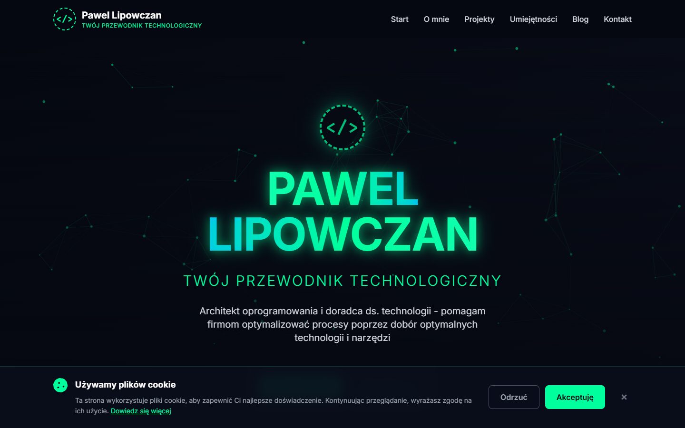

# Pawel Lipowczan - Portfolio Website

Nowoczesna, responsywna strona portfolio zbudowana przy użyciu React, Vite, Tailwind CSS i Framer Motion. Zawiera charakterystyczny schemat kolorystyczny w odcieniach zieleni i turkusu z animowanymi elementami UI oraz funkcjonalnością bloga.

[](https://github.com/plipowczan/portfolio/actions/workflows/playwright.yml)




## 🎯 Status Projektu

- **Status:** ✅ WDROŻONE i DZIAŁAJĄCE w produkcji
- **URL:** [pawellipowczan.pl](https://pawellipowczan.pl)
- **Aktualna wersja:** 1.0.0
- **Ostatnia aktualizacja:** 2025-11-23
- **Hosting:** Vercel z automatycznymi wdrożeniami

## 🚀 Główne Funkcjonalności

### Ukończone Features

- ✅ **Responsywny design** - Działa perfekcyjnie na mobile, tablet i desktop
- ✅ **System blogowy** - 8+ postów z renderowaniem markdown i wyróżnianiem składni
- ✅ **Prerendering dla SEO** - Statyczne HTML generowane przez Puppeteer
- ✅ **Strukturowane dane** - JSON-LD schemas (Person, BlogPosting)
- ✅ **Testy E2E** - Kompleksowe testy z Playwright
- ✅ **Strony prawne** - Pełna zgodność z RODO/GDPR (Polityka Prywatności, Regulamin, Cookies)
- ✅ **Animacje** - Płynne przejścia i efekty z Framer Motion
- ✅ **Formularz kontaktowy** - Z walidacją w czasie rzeczywistym
- ✅ **Tło sieciowe** - Animowany system cząstek (Canvas-based)
- ✅ **Meta tagi SEO** - Open Graph i Twitter Cards dla wszystkich stron
- ✅ **Dynamiczny sitemap** - Automatyczne generowanie z postami blogowymi
- ✅ **Vercel Analytics** - Monitorowanie ruchu i Core Web Vitals

### Sekcje Strony

- **Hero** - Animowane intro z gradientowym tekstem i tłem sieciowym
- **O mnie** - Przedstawienie z statystykami i CV
- **Projekty** - Siatka projektów z efektami hover i badgami technologii
- **Umiejętności** - Stack technologiczny zorganizowany po kategoriach
- **Kontakt** - Formularz z walidacją i linki do mediów społecznościowych
- **Blog** - Lista postów i strony indywidualnych artykułów
- **Strony prawne** - Privacy Policy, Terms of Service, Cookie Policy

## 📊 Wydajność i SEO

### Core Web Vitals

**Aktualne metryki** (2025-11-23):

- **FCP (First Contentful Paint):** 5.3s ⚠️ (cel: <1.8s - w optymalizacji)
- **LCP (Largest Contentful Paint):** 5.8s ⚠️ (cel: <2.5s - w optymalizacji)
- **TBT (Total Blocking Time):** 78ms ✅ (cel: <200ms - doskonale)
- **CLS (Cumulative Layout Shift):** 0 ✅ (cel: <0.1 - perfekcyjnie)
- **TTI (Time to Interactive):** 5.8s ⚠️ (wymaga poprawy)
- **Speed Index:** 5.5s ⚠️ (średnio)

**Bundle Size:**
- JavaScript: ~231 KB (gzipped: ~155 KB)
- CSS: ~27 KB (gzipped: ~5 KB)
- Czas buildu: ~4 sekundy

### SEO

- ✅ **Prerendering** - Wszystkie strony generowane jako statyczny HTML
- ✅ **Strukturowane dane** - JSON-LD schemas dla Person i BlogPosting
- ✅ **Meta tagi** - Pełne Open Graph i Twitter Cards
- ✅ **Sitemap.xml** - Dynamicznie generowany z postami blogowymi
- ✅ **robots.txt** - Skonfigurowany dla crawlerów
- ✅ **Canonical URLs** - Dodane do wszystkich stron
- ✅ **Język** - Prawidłowo ustawiony `lang="pl"` w HTML
- ✅ **Obrazki OG** - 1200x630px dla wszystkich stron

**Aktualna ocena SEO:** 7/10 (cel: 9/10)

## ⚠️ Aktualne Wyzwania

**Wysoki priorytet:**

1. 🔴 **Optymalizacja wydajności** - FCP/LCP > 5s (cel: <2.5s)
   - Font loading blokuje renderowanie
   - Brak code-splitting
   - Bundle size do optymalizacji

2. 🔴 **Uzupełnienie linków do projektów** - Brakujące live URLs
   - Dodać poprawne linki `liveUrl` do projektów
   - Ewentualnie linki do szablonów automatyzacji (Make/n8n)

3. 🟡 **Internal linking** - Linkowanie wewnętrzne w postach
   - Sekcja "Related Posts" na końcu artykułów
   - Linki do portfolio w postach blogowych

4. 🟡 **Optymalizacja obrazków**
   - Format WebP z fallback do PNG
   - Lazy loading dla wszystkich obrazków
   - Dodać `srcset` dla różnych rozmiarów

5. 🟡 **Accessibility** - Dalsze usprawnienia
   - Color contrast check (WCAG AA)
   - Skip to content link
   - Aria labels dla interaktywnych elementów

## 🎨 System Designu

### Paleta Kolorów

- **Primary Green**: `#00ff9d`
- **Secondary Cyan**: `#00b8ff`
- **Dark Background**: `#050810` do `#0a0e1a`
- **Card Background**: `#151b2b`

### Typografia

- **Nagłówki**: Inter (Bold)
- **Tekst**: Inter (Regular)
- **Kod**: Fira Code

### Efekty Wizualne

- Geometryczne tło sieciowe/mesh
- Efekty gradientowego tekstu na nagłówkach
- Karty z efektem glassmorphism i backdrop blur
- Animacje smooth scroll
- Efekty hover ze scale/glow transitions

## 🛠️ Stack Technologiczny

### Frontend Framework

- **React 19.2.0** - Biblioteka UI z Hooks
- **Vite 7.2.2** - Build tool i serwer deweloperski nowej generacji

### Styling & UI

- **Tailwind CSS 3.4.18** - Framework CSS utility-first
- **Framer Motion 12.23.24** - Biblioteka animacji
- **PostCSS 8.5.6** + **Autoprefixer 10.4.22**

### Routing & Navigation

- **React Router 7.9.6** - Routing po stronie klienta
- Browser routing (BrowserRouter) dla czystych URL-i

### Content & SEO

- **React Helmet Async 2.0.5** - Dynamiczne meta tagi SEO
- **React Markdown 10.1.0** - Renderowanie treści bloga
- **gray-matter 4.0.3** - Parsowanie frontmatter markdown
- **React Icons 5.5.0** - Komponenty ikon

### Prerendering & Performance

- **Puppeteer Core 24.32.1** - SEO prerendering
- **@sparticuz/chromium 133.0.0** - Prerendering kompatybilny z Vercel
- **Vercel Analytics 1.5.0** - Analityka odwiedzających
- **Vercel Speed Insights 1.3.0** - Monitorowanie Core Web Vitals

### Testing

- **Playwright 1.56.1** - Testy end-to-end

## 📋 Wymagania

- **Node.js**: 20.19+ lub 22.12+ (wymagane dla Vite 7)
- **npm**: 9.0+ lub **yarn**: 1.22+

## 📦 Instalacja

1. Sklonuj repozytorium:

```bash
git clone https://github.com/plipowczan/portfolio.git
cd portfolio
```

2. Zainstaluj zależności:

```bash
npm install
```

3. Uruchom serwer deweloperski:

```bash
npm run dev
```

4. Zbuduj wersję produkcyjną:

```bash
npm run build
```

5. Podgląd wersji produkcyjnej:

```bash
npm run preview
```

## 📁 Struktura Projektu

```
portfolio/
├── public/
│   ├── logo.svg              # Logo główne
│   ├── images/               # Obrazy projektów/bloga
│   └── og/                   # Obrazy Open Graph
├── src/
│   ├── components/
│   │   ├── layout/          # Navigation, Footer, Layout
│   │   ├── sections/        # Hero, About, Projects, Skills, Contact
│   │   ├── animations/      # NetworkBackground
│   │   ├── seo/             # StructuredData
│   │   └── ui/              # Komponenty UI do wielokrotnego użycia
│   ├── pages/
│   │   ├── Home.jsx
│   │   ├── Blog.jsx
│   │   ├── BlogPostPage.jsx
│   │   ├── ProjectPage.jsx
│   │   └── Strony prawne (Privacy, Terms, Cookies)
│   ├── data/
│   │   ├── projects.js      # Dane projektów
│   │   ├── skills.js        # Dane umiejętności
│   │   └── blogPosts/       # Markdown posty blogowe
│   ├── utils/
│   │   ├── constants.js     # Konfiguracja strony i stałe
│   │   └── blogLoader.js    # Ładowanie postów z markdown
│   ├── styles/
│   │   └── index.css        # Style globalne
│   ├── App.jsx
│   └── main.jsx
├── scripts/
│   ├── prerender.mjs        # Skrypt prerenderingu SEO
│   └── generate-sitemap.mjs # Generowanie sitemap.xml
├── tests/                   # Testy E2E Playwright
├── docs/                    # Dokumentacja
│   ├── README.md           # Indeks dokumentacji
│   ├── PRD.md              # Product Requirements (EN - dla AI)
│   ├── SRS.md              # Specyfikacja techniczna (EN - dla AI)
│   ├── QUICK_START.md      # Szybki start (PL)
│   ├── deployment/         # Przewodniki wdrożenia (PL)
│   ├── seo/                # Dokumentacja SEO (PL)
│   ├── blog/               # System blogowy (PL)
│   ├── testing/            # Testy E2E (PL)
│   └── maintenance/        # TODO i bugfixy (PL)
├── AGENTS.md               # Główny plik dla AI agents (EN)
├── .cursorrules            # Wytyczne rozwoju (EN)
├── package.json
├── vite.config.js
├── tailwind.config.js
└── README.md
```

## 🔧 Konfiguracja

### Konfiguracja Strony

Edytuj [src/utils/constants.js](src/utils/constants.js) aby zaktualizować:

- Nazwę strony i tytuł
- Email i linki do mediów społecznościowych
- Elementy menu nawigacji

### Projekty

Dodaj/edytuj projekty w [src/data/projects.js](src/data/projects.js)

### Umiejętności

Zaktualizuj umiejętności i technologie w [src/data/skills.js](src/data/skills.js)

### Posty Blogowe

Utwórz nowe posty blogowe jako pliki markdown w [src/data/blogPosts/](src/data/blogPosts/)

## 🎨 Personalizacja

### Kolory

Edytuj [tailwind.config.js](tailwind.config.js) aby dostosować paletę kolorów:

```js
colors: {
  primary: { /* odcienie zieleni */ },
  secondary: { /* odcienie turkusu */ },
  dark: { /* ciemne tła */ }
}
```

### Animacje

Niestandardowe animacje są zdefiniowane w:

- [tailwind.config.js](tailwind.config.js) - Utility animacji
- [src/styles/index.css](src/styles/index.css) - Niestandardowe animacje CSS
- [src/utils/constants.js](src/utils/constants.js) - Warianty Framer Motion

## 📱 Responsive Breakpoints

- **Mobile**: < 640px
- **Tablet**: 640px - 1024px
- **Desktop**: > 1024px

## ⚡ Wydajność

- Lazy loading dla route'ów i obrazów
- Code splitting z React.lazy()
- Zoptymalizowane animacje (tylko transform i opacity)
- Zminimalizowany rozmiar bundle
- Efektywne re-rendery z React.memo

## 🔍 Funkcje SEO

- Semantyczne elementy HTML5
- Meta tagi (Open Graph, Twitter Cards)
- Strukturowane dane (JSON-LD)
- Opisowy tekst alt dla obrazów
- Czysta struktura URL
- Dynamiczny sitemap.xml
- Prerendering dla wszystkich stron

## 📄 Zgodność Prawna

- Zgodność z GDPR/RODO
- Polityka Prywatności
- Polityka Cookies
- Regulamin
- Wszystkie dokumenty prawne dostępne ze stopki

## 🚀 Wdrożenie

### Vercel (Zalecane)

```bash
npm install -g vercel
vercel login
vercel
```

### Netlify

```bash
npm run build
# Przeciągnij folder 'dist' do Netlify
```

### GitHub Pages

Zaktualizuj `vite.config.js`:

```js
export default defineConfig({
  base: "/nazwa-repozytorium/",
  // ... reszta konfiguracji
});
```

**Szczegóły:** Zobacz [docs/deployment/DEPLOYMENT.md](docs/deployment/DEPLOYMENT.md) dla pełnego przewodnika wdrożenia.

## 📚 Dokumentacja

### Dla Użytkowników (Polski)

- **[Pełna dokumentacja](./docs/README.md)** - Indeks całej dokumentacji
- **[Szybki start](./docs/QUICK_START.md)** - 5-minutowy przewodnik
- **[Przewodnik wdrożenia](./docs/deployment/DEPLOYMENT.md)** - Jak wdrożyć na Vercel/Netlify
- **[Weryfikacja SEO](./docs/seo/SEO_VERIFICATION.md)** - Checklist po wdrożeniu
- **[Workflow bloga](./docs/blog/BLOG_WORKFLOW.md)** - Jak dodać nowy post
- **[Testy E2E](./docs/testing/TESTING_QUICKSTART.md)** - Jak uruchomić testy
- **[Zadania i ulepszenia](./docs/maintenance/TODO.md)** - Roadmap i TODOs

### Dla AI/Agentów (English)

- **[AGENTS.md](./AGENTS.md)** - Main entry point for AI agents
- **[PRD - Product Requirements](./docs/PRD.md)** - Business requirements and brand identity
- **[SRS - Technical Specification](./docs/SRS.md)** - System architecture and functional requirements
- **[.cursorrules](./.cursorrules)** - Development guidelines and coding standards

## 🤝 Contributing

To jest projekt osobistego portfolio, ale sugestie i feedback są mile widziane!

1. Fork repozytorium
2. Utwórz branch z nową funkcją (`git checkout -b feature/AmazingFeature`)
3. Commit zmian (`git commit -m 'Add some AmazingFeature'`)
4. Push do brancha (`git push origin feature/AmazingFeature`)
5. Otwórz Pull Request

## 📝 Licencja

Ten projekt jest open source i dostępny na licencji [MIT License](LICENSE).

## 📧 Kontakt

Pawel Lipowczan - [pawel@lipowczan.pl](mailto:pawel@lipowczan.pl)

Link do projektu: [https://github.com/plipowczan/portfolio](https://github.com/plipowczan/portfolio)

Live website: [https://pawellipowczan.pl](https://pawellipowczan.pl)

## 🙏 Podziękowania

- Inspiracja designu z [heyalice.app](https://heyalice.app/)
- Ikony z [React Icons](https://react-icons.github.io/react-icons/)
- Fonty z [Google Fonts](https://fonts.google.com/)
- Paleta kolorów inspirowana nowoczesną estetyką tech

---

**Zbudowane z ❤️ przy użyciu React + Vite + Tailwind CSS + Framer Motion**
