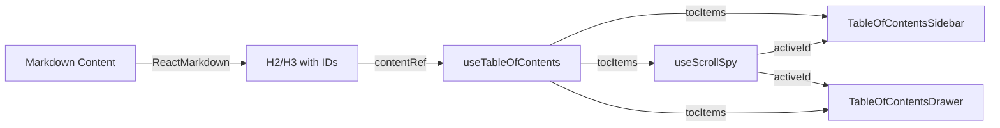

# Blog Table of Contents - Technical Documentation

**Last Updated:** 2026-01-18
**Implementation Date:** 2026-01-16
**Status:** Production

---

## Overview

Automatic Table of Contents (TOC) system for blog articles, providing desktop sidebar navigation and mobile drawer for improved UX.

**Key Features:**
- Auto-generated from H2/H3 markdown headings
- Desktop sticky sidebar (≥1024px)
- Mobile FAB + drawer (<1024px)
- Scroll spy with active section highlighting
- Hierarchical structure support
- Accessibility compliant (WCAG 2.1 AA)

**File:** `src/pages/BlogPostPage.jsx` (lines 15-184, 309-333, 758-777)

---

## Architecture

### Component Structure

```
BlogPostPage.jsx
├── generateSlug(text) → string           # Generate URL-safe slug from heading text
├── useTableOfContents(el) → tocItems[]   # Extract H2/H3 headings from DOM
├── useScrollSpy(items) → activeId        # Track active section
├── TableOfContentsSidebar                # Desktop sticky sidebar (inline)
│   └── Props: { items, activeId, onScrollToSection }
├── FloatingTOCButton                     # Mobile FAB (inline)
│   └── Props: { onClick }
└── TableOfContentsDrawer                 # Mobile drawer (inline)
    └── Props: { items, activeId, isOpen, onClose, onScrollToSection }
```

### Data Flow



---

## Implementation Details

### 1. Slug Generation

**Function:** `generateSlug(text)`

**Purpose:** Convert heading text to URL-safe ID

**Logic:**
1. Convert to lowercase
2. Remove special characters (keep alphanumeric, spaces, hyphens)
3. Replace spaces with hyphens
4. Handle duplicates with counter suffix
5. Track used IDs with `usedIdsRef`

**Example:**
- Input: `"5 technik pracy z Claude Code"`
- Output: `"5-technik-pracy-z-claude-code"`
- Duplicate: `"5-technik-pracy-z-claude-code-1"`

### 2. TOC Extraction Hook

**Hook:** `useTableOfContents(contentElement)`

**Returns:** `Array<{ id: string, text: string, level: 'h2' | 'h3' }>`

**Implementation:**
```javascript
const useTableOfContents = (contentElement) => {
  return useMemo(() => {
    if (!contentElement) return [];
    
    const headings = contentElement.querySelectorAll('h2, h3');
    return Array.from(headings).map(heading => ({
      id: heading.id,
      text: heading.textContent,
      level: heading.tagName.toLowerCase()
    }));
  }, [contentElement]);
};
```

**Timing:**
- Runs after ReactMarkdown renders content
- Uses 150ms timeout to ensure DOM is ready
- Memoized to avoid recalculation

### 3. Scroll Spy Hook

**Hook:** `useScrollSpy(tocItems)`

**Returns:** `string` (active heading ID)

**Implementation:**
- Uses IntersectionObserver API
- Configuration: `rootMargin: '-20% 0px -35% 0px'`
- Throttled updates with `requestAnimationFrame`
- Cleans up observers on unmount

**Logic:**
1. Observe all headings in TOC
2. Find heading closest to top but still visible
3. Update `activeId` state
4. Highlight active link in TOC

### 4. Desktop Sidebar Component

**Component:** `TableOfContentsSidebar`

**Props:**
- `items: Array<TocItem>` - TOC items to display
- `activeId: string` - Currently active section ID
- `onScrollToSection: (id: string) => void` - Scroll handler

**Styling:**
- Position: `sticky top-24`
- Max height: `calc(100vh - 10rem)`
- Overflow: `overflow-y-auto` (scrollable)
- Visibility: `hidden lg:block`

**Features:**
- Hierarchical indentation (H3: `pl-4`)
- Active link: primary color
- Hover states
- Auto-scroll to keep active item visible

### 5. Mobile FAB + Drawer

**FloatingTOCButton:**
- Position: `fixed bottom-6 right-6 z-50`
- Icon: `FaList` (react-icons)
- Gradient background
- Hidden on desktop: `lg:hidden`

**TableOfContentsDrawer:**
- Animation: Slide up from bottom (Framer Motion)
- Backdrop: Semi-transparent overlay
- Close mechanisms: backdrop click, close button, after link click
- Body scroll lock when open

---

## Accessibility

### WCAG 2.1 AA Compliance

**Semantic HTML:**
- `<nav aria-label="Table of Contents">` for TOC wrapper
- `<aside>` for sidebar
- `<button>` for interactive elements

**Keyboard Navigation:**
- Tab through TOC links
- Enter to activate link
- Escape to close drawer (mobile)

**Focus Indicators:**
- Visible outline: `focus:ring-2 focus:ring-primary-500`
- Color contrast: 4.5:1 ratio

**Screen Readers:**
- ARIA labels on all interactive elements
- Descriptive button labels

---

## Performance

### Optimizations

1. **IntersectionObserver** - More efficient than scroll listeners
2. **Memoization** - `useMemo` for TOC items
3. **Ref-based tracking** - `usedIdsRef` prevents re-renders
4. **Conditional rendering** - Only render if ≥2 headings
5. **requestAnimationFrame** - Throttle scroll spy updates

### Metrics

- TOC generation: <50ms
- Scroll spy update: <16ms (60fps)
- No layout shifts (CLS = 0)
- No bundle size impact (no new dependencies)

---

## Edge Cases

### Handled

| Case | Solution |
|------|----------|
| 0-1 headings | TOC does not render |
| Duplicate heading text | Append counter suffix to ID |
| Very long TOC | Sidebar scrolls independently |
| Fast scrolling | Throttled updates with rAF |
| Body scroll (drawer open) | `overflow: hidden` on body |
| Special characters in headings | Remove/normalize in slug |

### Not Handled (by design)

| Case | Reason |
|------|--------|
| H1 headings | Reserved for article title |
| H4+ headings | Too deep, rarely used |
| Nested H3 under H3 | Markdown structure issue |

---

## Testing

### Manual Testing Checklist

**Desktop:**
- [ ] TOC sidebar appears on right
- [ ] Sidebar is sticky
- [ ] Active section highlights correctly
- [ ] Clicking TOC link scrolls smoothly
- [ ] Long TOC scrolls independently

**Mobile:**
- [ ] FAB appears bottom-right
- [ ] Clicking FAB opens drawer
- [ ] Drawer closes after link click
- [ ] Backdrop closes drawer

**Accessibility:**
- [ ] Keyboard navigation works
- [ ] Focus indicators visible
- [ ] Screen reader announces TOC

### E2E Tests (Future)

**Test file:** `tests/e2e/blog-toc.spec.js`

```javascript
test('Desktop TOC displays and navigates', async ({ page }) => {
  await page.goto('/blog/5-technik-pracy-z-claude-code');
  await expect(page.locator('[aria-label="Table of Contents"]')).toBeVisible();
  await page.click('text=PRD-first development');
  // Verify scroll position
});

test('Mobile FAB opens drawer', async ({ page, isMobile }) => {
  test.skip(!isMobile);
  await page.goto('/blog/5-technik-pracy-z-claude-code');
  await page.click('button[aria-label="Open Table of Contents"]');
  await expect(page.locator('text=Spis treści')).toBeVisible();
});
```

---

## Maintenance

### When to Update

1. **New heading levels:** If H4+ support needed, update hooks
2. **Styling changes:** Update Tailwind classes in components
3. **Animation changes:** Modify Framer Motion variants
4. **Performance issues:** Profile and optimize IntersectionObserver

### Related Files

| File | Purpose |
|------|---------|
| `src/pages/BlogPostPage.jsx` | Main implementation |
| `.claude/agents/plans/blog-sidebar-navigation.md` | Original plan |
| `.claude/agents/reports/execution-report-blog-sidebar-navigation.md` | Execution report |
| `docs/BLOG_WORKFLOW.md` | Author guidelines |

---

## References

**Implementation:**
- Date: 2026-01-16
- Plan: `.claude/agents/plans/blog-sidebar-navigation.md`
- Report: `.claude/agents/reports/execution-report-blog-sidebar-navigation.md`

**Dependencies:**
- `react-icons` (FaList, FaTimes)
- `framer-motion` (drawer animations)
- `react-markdown` (heading rendering)

**Browser APIs:**
- IntersectionObserver (scroll spy)
- scrollIntoView (smooth scrolling)
- querySelector (heading extraction)
